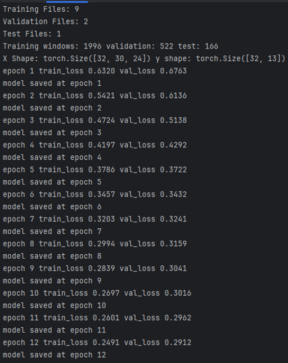
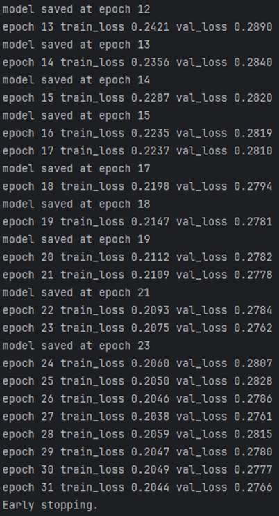
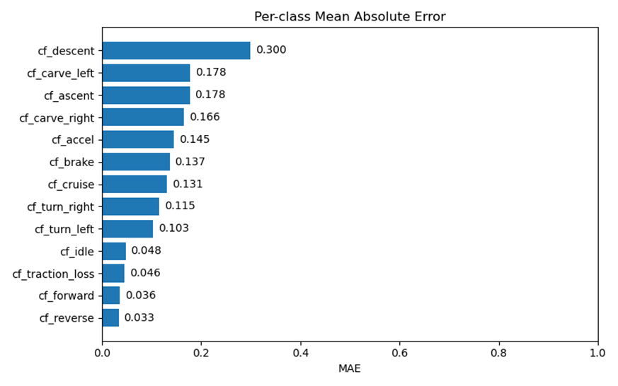
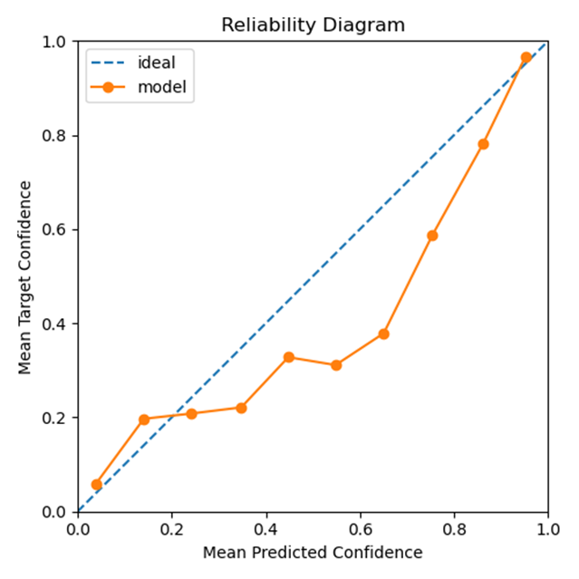
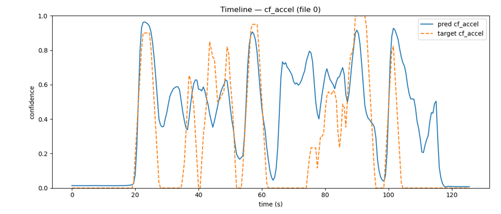
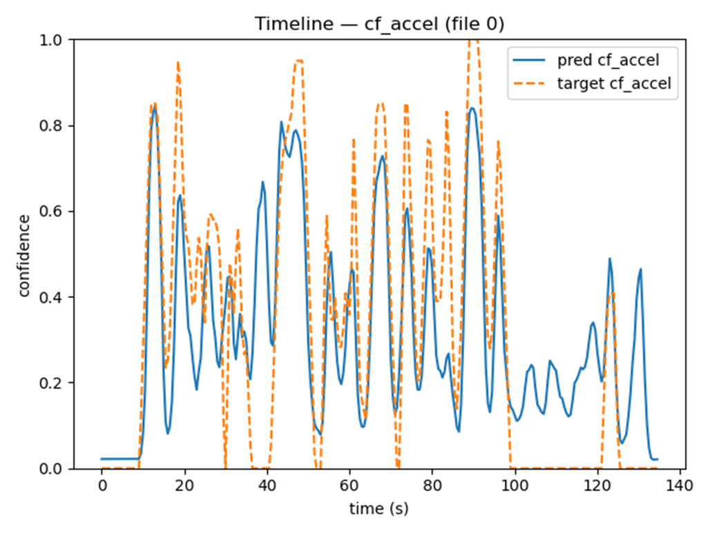

# VESC ML Telemetry Analyzer

### Overview

The purpose of the VESC Analyzer project is to train a machine learning model to 
identify rider behaviors and detect anomalies resulting from improper device configuration or 
hardware malfunction in onewheel style PEVs. The model is trained on telemetry data from the 
VESC open-source electronic speed controller software. I have developed a data preprocessing 
pipeline for ingestion, formatting, cleaning, normalizing sample rates, interpolation of data 
features across the normalized sample rates, and classifying behaviors on a confidence scale 
through a combination of Python scripts and manual segment labeling in Label Studio. The 
primary motivation for the project comes from my hobbyist obsession with VESC onewheels. 
Further inspiration comes through the many potential use cases for a model that can classify 
ride behaviors and detect anomalies; these features could be highly valuable to the VESC 
onewheel community for troubleshooting and customizing device behavior.  

The most plausible use case of machine learning on VESC telemetry data is for 
troubleshooting and configuration error detection. This initial proof of concept does not include 
training for troubleshooting or configuration purposes. The prototype model is trained to 
identify primitive rider behaviors, such as acceleration, braking, cruising, and turning. Training a 
model to detect improper configurations or faulty hardware will require a larger dataset 
gathered from misconfigured devices and a diverse array of devices, in order to make improper 
configuration behaviors identifiable in a way that would be useful to other riders. These 
improvements and feature additions I have just listed are discussed in greater detail in this 
project proposal as the long-term project goals for VESC Analyzer. 

The proof of concept and prototype application that I have developed includes data 
preprocessing, labeling, and model training pipelines that supply a strong starting point from 
which to build out the features of a more useful model that is capable of providing 
troubleshooting assistance through recognition of telemetry patterns that result from 
improperly configured devices or faulty hardware. The model and pipeline that I have 
developed are integral first steps in developing a more sophisticated VESC Analyzer model. This 
model is suitable to serve as a base model within a multi-stage modular machine learning 
architecture in which the base model analyzes ride logs and identifies rider behaviors while also 
providing anomaly detection. In such an architecture, each data sample, across all telemetry 
features, would be given a combined anomaly score. This anomaly score would then be 

averaged for all samples within a ride log. The output of the model’s behavior classification 
would be presented to the user in the same way that the current prototype application 
presents this analysis, through time series graphical visualizations. The anomaly score for the 
entirety of the ride log would also be extracted from the analysis and compared against an 
anomaly threshold. If the anomaly score from the base model analysis exceeds the threshold, it 
would then be routed through a combination of smaller, more specialized ML models and rule
based systems in order to identify the most likely cause(s) of the anomalies and undesirable 
behaviors.  

A modular ML architecture with additional rule-based systems, where suitable, will 
allow this application to expand in a way that does not require constant retraining of the base 
model, nor continuous changes to the log files and preprocessing that were used in training of 
the base model. The architecture will allow the training of individual specialized models as data 
becomes available for new troubleshooting issues without significant rework of the core 
system. Ultimately, these prototype preprocessing, labeling, model training pipelines, and the 
base model, in conjunction with a modular architecture moving forward, will provide a system 
in which the various model capabilities can adapt and evolve to the needs of the community.

### Data Acquisition and Preprocessing Pipeline

For the development of the VESC Analyzer prototype, I began with data acquisition of 
VESC real-time ride logs with accompanying video and audio capture of the corresponding ride 
sessions. I conducted a total of 54 ride trials/sessions, with each trial ranging in duration from 
one to four minutes. The prototype model includes 11 of these logs (~18 minutes), processed 
and labeled for training, validation, and testing data splits. I used only a small portion of the 
data that I originally collected because the labeling process was far more time-consuming than 
anticipated, and it was not practical for the purpose of this prototype for me to include more 
labeled logs. The quantity of data provided by these 11 logs proved sufficient for training the 
prototype and producing accurate analyses of the core ride behaviors.  

While collecting the data across a variety of ride sessions, the action camera that I used 
for video capture was held on a rod, down at nearly ground level, and pointing directly at one 
side of the onewheel device. This enabled me to visually identify the changes in pitch and roll 
that correspond to a variety of behaviors in onewheel devices for the purposes of labeling these 
behaviors in the logs. I used a microphone paired with the action camera for narration to help 
clarify the behaviors taking place that are not always easy to discern from the video. This 
includes things like changes in terrain grade and helps clarify subtle direction changes and other 
events. I also used screen recording of the VESC Tool application on my mobile device, which 
depicts device speed, pitch, and roll. This was useful for synchronizing the action camera 
footage with the ride logs. 

After I had collected these ride logs and recordings, I used the video editor Movavi to 
overlay the VESC Tool screen recording onto the action cam video to use as an additional frame 
of reference when comparing the video to the ride logs. Using the preprocessing scripts that I 
developed with Python in PyCharm, I processed these logs to produce a CSV file that was easier 
to parse due to formatting improvements, like separate columns for each feature, row indexes, 
and VESC timestamps converted to UTC and PST. I used these cleanly formatted logs to identify 
key behavior features in the log file that correspond to an event in the video footage. This was 
usually the initial engagement of the device because at engagement, the pitch steadily 
descends from ~20 degrees to 0 and then becomes negative, while the duty cycle, speed, and 
motor current also rise dramatically here. I used this event coordination to identify a timestamp 
in the video footage that corresponds to a particular log sample timestamp so that I could align 
these two resources based on those times. 

I then ran the log file through an additional preprocessing script with the log timestamp and video 
timestamp as input so that the script could insert the corresponding video timestamp and propagate 
video timestamps across the log at the same increment as the normalized log sample rate (100-ms, 
or 10 Hz). This processing step enabled me to use the video timestamps along the x-axis in Label 
Studio, making translating behaviors in the video recordings to segments in the log files much 
easier. The preprocessing script described above also made a few other changes to the data 
that were essential for training the model. A primary feature of the preprocessing script is the 
inclusion of a function for sample rate normalization 
(vesc_analyzer/preprocessing/training_preprocessing.py). This function extracts start and end 
times of each log and inserts rows into the log file at 100-ms (10 Hz) increments for 
interpolated values to be inserted into. The values for these normalized sample rows are 
interpolated (with the Pandas library's interpolate method) from the surrounding real data 
samples to maintain an accurate representation of device state. Any sample gaps in the raw 
telemetry that exceed 250 ms are deemed infeasible for interpolation, and these spans are 
replaced with NaN values for the telemetry data instead. A variety of functions from the NumPy 
library support these transformations. The rows within the log file that do not correspond to 
these 100-ms increments from the start point are then removed by the preprocessing script so 
that the log file consists of only 100-ms steps between samples. This script also inserts columns 
for each of the behaviors that I trained the model on, so that confidence scores can be later 
inserted into these cells during labeling. 

Once the log file has been processed by this Python script to include behavior columns, 
timestamps for UTC, PST, and video, and a normalized sample rate, the log is then exported as a 
CSV and is ready for import into Label Studio. Using Label Studio and the corresponding ride 
footage, I then labeled behavior segments with confidence scores that represent the 
intensity/confidence of the behavior at times when I could identify these characteristics.  Once 
the labeling of each log was completed, I exported the annotation CSV file from Label Studio 
and merged the behavior annotations with the processed log file. This was done using another 
Python script (vesc_analyzer/preprocessing/training_apply_behavior_annotations.py), which 
took the start and end times of each annotation, the behavior label, and the confidence value 
to identify rows and columns where the confidence values should be inserted. In this script, I 
also defined exclusivity groups for ride behaviors that are implicitly exclusive, such as acceleration 
and braking. This includes internally exclusive groups, in which the behaviors within the list are 
exclusive from one another, and cross-exclusive groups, which are groups that are exclusive to
the behaviors in another exclusivity group. For any behavior belonging to one of the exclusivity 
groups, in a log segment where that behavior was labeled with a confidence value greater than 
0.05 in Label Studio, any behaviors that are members of a group that is either internally or 
cross-exclusive to this confident behavior are labeled with a confidence score of 0.0. This 
scripting automation helped to reduce the tedium of the labeling process. 

At the next stage of the ETL pipeline, the processed and labeled log files are prepared 
specifically for the machine learning process. The Python scripts for this stage 
(vesc_analyzer/model/vesc_dataset.py) use the PyTorch framework to organize the data into 
tensor data structures, window the log samples into 3-second windows for analysis, and 
normalize the telemetry feature values so that the values use a similar value scale across 
dissimilar features (vesc_analyzer/model/normalize.py). The entirety of each log is divided into 
3-second windows at step increments of 0.5 seconds (e.g., window 1 = 0.0 to 3.0 seconds, 
window 2 = 0.5 to 3.5 seconds, etc.). I also removed the GNSS telemetry features from the logs 
at this stage of the pipeline because, during the labeling process, I found them to be inaccurate 
at times, particularly with the GNSS altitude reading. After the ride logs have been windowed 
for machine learning analysis, they can be organized by another Python script 
(vesc_analyzer/model/build_data_splits.py) and split into separate training, validation, and 
testing groups for the model to make use of accordingly, with log names specified for the 
validation and testing groups, and the rest of the logs being designated for training. 

The production version of the prototype uses a separate preprocessing script for 
processing logs uploaded by users that differs only slightly from the training preprocessing. The 
logs that are analyzed by the trained model in production do not need the behavior confidence 
columns to be inserted into the log file, so the portion of the training preprocessing script that 
added these behavior confidence columns was removed from the production preprocessing 
script. Consequently, the annotation merging script for Label Studio behavior labels is not used 
in production either. The script logic for inserting a column for video timestamp synchronization 
was also removed from the production preprocessing scripts. The sample rate normalization 
and value interpolation remain in the production preprocessing. 

### Model Training

For the machine learning portion of VESC Analyzer, I implemented a 1-D Convolutional 
Neural Network (CNN) for multi-label behavior classification using time-series telemetry data 
(e.g., ERPM, duty cycle, pitch, roll). I chose a Conv1d architecture because it is designed for one
dimensional sequences and can learn temporal patterns by applying learnable filters across 
time (GeeksforGeeks, 2024; PyTorch, n.d.-c). Conv1d captures sequential structure by sliding 
these filters along the sequence to produce transformed feature maps (GeeksforGeeks, 2025
a). I also used the ReLU activation function, which improves training efficiency, maintains 
nonlinearity, and reduces vanishing-gradient issues common with saturating activations like 
sigmoid (GeeksforGeeks, 2025-a). 

During training, I used the PyTorch DataLoader to divide the dataset into mini-batches 
of telemetry windows. The batches included inputs shaped (B, T, C) and targets shaped (B, K), 
where B is the number of windows in the batch, T is the number of time steps per window, C is 
the number of sensor channels per window, and K is the number of behavior labels (one score 
per label) (PyTorch, n.d.-c). Each target row is a multi-label probability/confidence vector for 
the behaviors in that window (Szymański & Kajdanowicz, 2017).  

For the initial training, I used two Conv1d layers (64 output channels each), with each layer 
followed by the ReLU activation function. Each batch of data is fed through the model for a 
forward pass, where the inputs are permuted to (B, C, T), because Conv1d requires the 
channels first (PyTorch, n.d.-c). After initial testing of the model performance, I added 
additional Conv1d layers and a Residual Block. A common issue with increasing the number of 
layers for deep learning is that it increases the error rate of the model due to the vanishing 
gradient problem (GeeksforGeeks, 2025-b). The Residual Block enables the use of additional 
layers by implementing a technique known as skip connections, which connect activations of a 
layer to further layers by skipping some of the layers between (GeeksforGeeks, 2025-b). These 
skip connections let the block learn refinement, preserving low-level signals and improving 
gradient flow for the deepened neural network (GeeksforGeeks, 2025-b). I also included 
BatchNorm1d on specific layers chosen through trial and error. BatchNorm1d performs 
temporal batch normalization, which normalizes activations per channel across each batch 
(PyTorch, n.d.-b). This stabilized the scale and also sped up training. 

Through the additional Conv1d stacks, I increased channel capacity across layers. This 
allowed me to preserve low-level signals in the Residual Block with 24 channels. I then 
expanded the 24 channels to 32 channels in the next two layers, adding dilation to steadily 
increase the model’s temporal receptive field at each layer. In the last Conv1d layer, the 
capacity is expanded to 64 channels, with dilation=2. Expanding the receptive field allows the 
model to effectively see further in time without extra parameters, which in turn enables the 
model to capture slower trends like grade changes while earlier layers capture small local 
changes, such as change points for acceleration, braking, and abrupt turns (PyTorch, n.d.-c; 
Aston et al., n.d.).  Then, AdaptiveAvgPool1d performs a global average over time for each of 
the 64 learned channels from the last Conv1d layer. This turns the Conv1d shape (B, C, T) into a 
summary vector for each window by producing one number for each Conv1d channel (PyTorch, 
n.d.-a). 

For the final steps, a linear head maps this 64-D summary vector to (B, K) logits, with 
one raw score per behavior. BCEWithLogitsLoss applies sigmoid to these logits and computes 
binary cross-entropy of the sigmoid probabilities against the target confidences for each 
behavior (PyTorch, n.d.-d). Each behavior classification is scored independently with sigmoid, 
allowing multiple behaviors to be active simultaneously. The targets are continuous floating
point confidences in [0, 1] from the labeling phase, where 0 and 1 are hard negatives or 
positives, and the values between are soft confidences. For each batch, the gradients are 
zeroed before running the forward pass, and then the loss is calculated. Loss.backward() is 
called to compute the gradients with respect to the model parameters. In the labeling process, 
not all samples were given a confidence rating for every behavior because the certainty of the
absence of a behavior was difficult to establish. Any label segments that were not assigned a 
confidence value were assigned as NaN (Not a Number). Behavior values with NaN entries (i.e., 
unlabeled) were masked to prevent them from polluting the loss calculations. The backward 
propagation is followed by optimizer.step(), which uses the Adam algorithm to adapt learning 
rates per parameter before proceeding to the next batch (PyTorch, n.d.-e). At this stage, the 
model has produced a confidence value for each behavior, in each window, in the form of a K
dimensional vector of confidence values, where K is the number of behaviors being tracked. 
The training loss of each epoch is the mean of batch losses, weighted by batch size, averaged 
across all labeled behaviors. Validation and training loss are reported for each epoch, and the 
validation loss is used for early stopping when the loss stops improving. Here is a sample output 
from the training and validation: 

### Validation Methods

The VESC Analyzer model was trained using supervised methods for multi-label 
classification. From prior log labeling, each window has floating-point confidence scores in [0, 1] 
for multiple behaviors (or NaN for unlabeled behaviors within a window). For each window, the 
model produces a K-dimensional vector of per-behavior scores: logits that are converted to 
probabilities using sigmoid. During validation, the model’s predictions are compared to the 
available targets (confidence labels) using BCEWithLogitsLoss, ignoring NaN labels by masking 
them, so only labeled entries contribute to loss calculations.  

The validation method was implemented through the use of specified data splits that 
divided ride sessions/logs into splits (vesc_analyzer/model/build_data_splits.py). The individual 
log files were not fragmented; each log was assigned entirely to one split. These splits included 
specific logs for a training split, a validation split, and a test split. The data splits ensured that 
there was no leakage between splits, i.e., that no data from the logs appeared in more than one 
split. Validation was run with model.eval() and inside torch.no_grad() to disable gradient 
tracking and ensure that no parameter updates occur during validation (PyTorch, n.d.-f). Early 
stopping based on validation loss was used during training, and the model checkpoint with the 
lowest validation loss observed thus far was saved before continuing. 

### Metrics

For testing the model’s performance, the primary metric that I chose to use was the 
mean absolute error (MAE). Mean absolute error is a “measure of errors between paired 
observations expressing the same phenomenon” (Wikipedia, 2024). MAE can be used to 
measure the average absolute difference between the model’s predicted confidence and the 
target confidence for each behavior. The labels produced during the labeling process and the 
confidences generated by the model are both soft labels (i.e., non-binary), which makes MAE a 
fitting metric to use to identify how closely the confidences calculated by the model are to the 
human labels.  

For the inclusion of this metric in the training results, I used the held-out test set from 
the data split to calculate the per-class MAE, as well as the macro MAE, which is the 
unweighted mean across all classes. For the calculation of the MAE scores, I wrote a Python 
script that looks at each behavior class individually and masks the NaN values to only include 
test windows that have a label for that particular behavior (vesc_analyzer/model/eval.py). The 
script computes the absolute difference between each predicted confidence and the target 
confidence in a given window, and then averages these absolute errors across all labeled 
windows for that behavior. This is repeated for each behavior. To calculate the macro MAE, 
these per-class MAEs are then combined to find the average. For the most recent version of the 
model, the training and evaluation computed a macro MAE of 0.1244. This essentially indicates 
that the model’s predictions differ from the human labels by about 12.4%. The per-class MAEs  
were plotted using MatPlotLib (vesc_analyzer/model/plot_metrics.py). The MAEs of the most 
recently trained (and deployed) model are depicted in the image below: 

I also wrote scripts to generate prediction reliability diagrams after model training. These 
diagrams can be used to assess whether the model’s predictions are well calibrated by again 
comparing the model's predictions against the human labels. To produce this reliability 
representation, the script groups the predicted confidences across all behaviors and the human 
labels into confidence bins. Because the confidence scale is 0 to 1, the bins were divided into 
deciles (ten bins: [0, 0.1),[0.1, 0.2), etc.). For each bin, behavior windows with a predicted 
confidence that falls in that bin’s range were combined to find the mean predicted confidence 
for behaviors within that bin. Next, the target confidences for the same windows from each 
prediction bin are combined to compute the mean of the target confidences for these windows. 
The two means are then plotted (MatPlotLib) with the predicted confidence of the window on the 
x-axis, and the target labeled confidence on the y-axis. This shows the difference in predicted 
vs. target confidence values by bin. As such, the diagram below indicates that the model is 
fairly consistent with the labels on the low and high ends of the confidence scale, but tends to 
be overconfident for windows in the mid-range bin. 

The final two diagrams that I will present here were also produced from the model 
training. This diagram resembles the final visualization that the deployed model generates after 
analyzing a ride log, in that the x-axis is a time series and the y-axis is the model’s predicted 
confidence of that behavior. The prediction confidence for the entire duration of the ride log is 
plotted for comparison with the plotting of the target confidences. I have included two of these 
diagrams to show the model’s improvements as I tuned the Conv1d layering and channels and 
added a Residual Block. These diagrams depict the acceleration confidence over the course of 
test ride logs, with the first diagram being from an earlier version of the model and the second 
diagram being the most recent deployed version. 

   

   

### User Guide and Application Demo

#### Hugging Face Deployment
The prototype VESC Analyzer machine learning application is deployed to Hugging Face spaces and can 
be accessed via this link: 

https://huggingface.co/spaces/daytondotdev/VESC_Tool_OW_Log_Analyzer 

Deployed Application User Guide: 

1. Navigate to the provided Hugging Face URL 
   *Note: if the application has not been used recently, it may need to be restarted 
   by clicking the “Restart” button after navigating to this page. Restart can take 
   approximately five minutes. 
2. Click “Browse Files” in the upper right side of the page 
3. Locate one of the raw log files from the downloaded repository root/DEMO_LOGS 
4. Upload a raw VESC Tool real-time log file 
5. Select the behavior classes that you wish to have plotted 
6. Click Run Analysis and wait for the log to be processed and analyzed 
7. Hover on the graph with your cursor to view behavior confidence values at a particular 
   point 
8. Adjust the plot classes and rerun analysis as desired 

Recommended: Select all plot classes EXCEPT for forward and reverse (easier to view). Run the 
analysis and review. Adjust the plot classes as desired and rerun the analysis. 

I have uploaded some of the video recordings for the demo logs if you would like to review them for comparison
to the model output:

• 2025-09-28_13-59-59.csv - ride log 31: youtube links coming soon

• 2025-09-28_14-10-31.csv - ride log 35:

• 2025-09-28_14-55-42.csv - ride log 42:

#### Running The Application Locally

Alternatively, the application can be run locally: 
Prereqs: 
• Git 
• Python 3.10 – 3.12 
   o Must be added to system PATH 
• You can check your Python version by running “python --version” in Windows PowerShell  
• Familiarity with Windows PowerShell or similar

Steps to run the application locally via Windows PowerShell: 
1. Clone the GitHub repository to your local machine using Git or download the source 
   code as a zip file 
   a. git clone https://github.com/abbottd6/Data-pipeline-and-ML-analyzer-for-VESC-telemetry.git 
   b. If you do not have Git installed or are unfamiliar with Git, you can download the 
   project as a ZIP. To do so, navigate to the GitHub repository URL: 
   https://github.com/abbottd6/Data-pipeline-and-ML-analyzer-for-VESC-telemetry 
   c. Click the green “Code” button 
   d. Click “Download ZIP” 
   e. Find the downloaded ZIP project folder 
   f. Extract the files to a desired location 
2. Open PowerShell and navigate to the root project directory on your system 
   (Data-pipeline-and-ML-analyzer-for-VESC-telemetry)
3. Create and activate a virtual environment by running the following commands in the 
   PowerShell Terminal: 

   python -m venv .venv

   Press “enter” on the keyboard

   .\.venv\Scripts\Activate.ps1 

   Press “enter” on the keyboard

4. Install dependencies by running the following commands in PowerShell: 
   
   python -m pip install --upgrade pip

   Press “enter” on the keyboard

   pip install -r requirements.txt

   Press “enter” on the keyboard

5. Wait for the dependencies to finish installing 
6. Run the application, type the following in PowerShell (from root): 
   
   streamlit run application/app.py

   Press “enter” on the keyboard 

7. This should automatically open a browser page and navigate to the application; if it does 
   not, you can open a browser manually and navigate to http://localhost:7860 
8. Click “Browse Files” in the upper right side of the page 
9. Locate one of the raw log files from the downloaded repository root/DEMO_LOGS 
10. Upload a raw VESC Tool real-time log file 
11. Select the behavior classes that you wish to have plotted 
12. Click Run Analysis and wait for the log to be processed and analyzed 
13. Hover on the graph with your cursor to view behavior confidence values at a particular 
point 
14. Adjust the plot classes and rerun analysis as desired

Recommended: Select all plot classes EXCEPT for forward and reverse (easier to view). Run the 
analysis and review. Adjust the plot classes as desired and rerun the analysis.

I have uploaded some of the video recordings for the demo logs if you would like to review them for comparison
to the model output:

• 2025-09-28_13-59-59.csv - ride log 31: youtube links coming soon

• 2025-09-28_14-10-31.csv - ride log 35:

• 2025-09-28_14-55-42.csv - ride log 42: